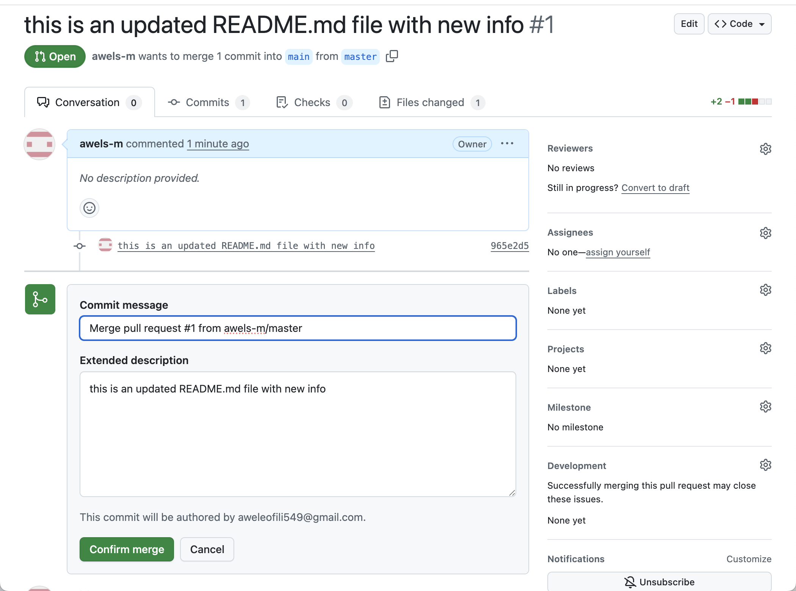

# jenkins_freestyle_project

## CREATING A FREESTYLE PROJECT
Here I created my first build job. the first thing i did was to go to my jenkins dashboard menu which is on the left side of the screen i clicked on the new item as seen in the image below. 

i went ahead to give the new item a name and also ticked on the freestyle job as seen in the image below.

## CREATING OF GIT REPOSITORY
I went ahead to create a github repository called "jenkins-scm"
after which i made it public and added a README.md file as seen in the image below 

## CONNECT Jenkins to jenkins-scm
i went ahead to connect the jenkins to the git repository that  had created. I went ahead to copy the link of the git repository and the images below depicts this

## configuring build trigger

i pasted the repository link in the area selected below. i also made sure current branch is main. i then went ahead to save configuration and run build now to connect jenkins to my repository. the images below depicts this 

## BUILD NOW 
I went ahead to build now and it was successful as seen in the image below

## CREATE A GITHUB WEBHOOK USING JENKINS IP ADDRESS AND PORT
I went ahead to create a github webhook using jenkins ip address. 
the first thing i did was to make sure that my jenkins was running. 

after confirming it is running. i went ahead to go to the setting of my repository and then clicked on webhook an create webhook. however due to the fact that the link for my jenkins was private and it failed and also because the link was a http link rather than https link i had to disable ssl verification. The images below depicts this

after it failed i had to go for an alternative using ngrok as seen in the images below 

and this was successful. 

## MAKING CHANGES IN ANY FILE IN MY GITHUB REPOSITORY
I had to first clone the git repository into my linux terminal so that i can have access to my README.md file and edit it as seen in the image below 

### CONFIRMING THE BRANCH IS MAIN
The next thing i did was to confirm that the branches was main. i did this by running this command "git branch" as seen in the image below 

### CONFIRMING THE FILES IN THE REPOSITORY
i went ahead to check the file in the repository using the command "ls"
the image below depicts this 

### CREATING CHANGES ON THE README.md FILE
I decided to use the vim text editor and went ahead to edit the README.md file as seen in the images below

i even went ahead to confirm the content of the newly edited README.md file using the "cat README.md" command as seen in image below 

## USING GIT ADD
i went ahead to add the new changes using this command "git add README.md" as seen in the image below 

## COMMITING THE CHANGES 
As seen in the image below i went ahead to commit the changes using the command "git commit -m" 

## CREATING A NEW BRANCH CALLED MASTER 
I then went ahead to create a new branch called master so that i can push the changes to the master branch as seen in the image below 

i used the command "git checkout -b master"

## PUSHING CHANGES TO THE MASTERS BRANCH 
I went ahead to push changes to the masters branch as seen in the image below using the command "git push -u origin master as seen in the image below 

## PULL REQUEST
I went ahead to pull request as seen in the images below 

## MERGE PULL REQUEST
I went ahead to merge the pull request as seen in the images below 

## NEW BUILD HAS BEEN LAUNCHED AUTOMATICALLY BY WEBHOOK
the images below depicts that the new build has been launched automatically by webhook

##  CONCLUSION

Completing this Jenkins Freestyle Job project marks a significant milestone in my DevOps journey, as I not only executed the steps but also encountered and resolved real-world issues that DevOps engineers face daily. My ability to troubleshoot beyond the scope of the task, apply practical tools like `ngrok`, and seamlessly integrate multiple systems demonstrates both my technical competence and problem-solving instincts.

I began by establishing a clean Jenkins environment, ensuring it was running reliably on your Linux terminal — the foundational skill every CI/CD practitioner must master. I then designed a Freestyle job from scratch, connected it to a newly created GitHub repository (`jenkins-scm`), and successfully configured Jenkins to pull from the `main` branch and trigger builds. This validated your understanding of job configuration, source control integration**, and basic build management within Jenkins.

When faced with a limitation — the inability of GitHub to reach my Jenkins server due to its local and HTTP-only status — you took initiative. You researched and implemented `ngrok`, a secure tunneling solution that exposed your Jenkins server to the public with HTTPS support. This step alone reflects deep adaptability. It shows that i am capable of engineering viable solutions to network-level integration problems, a common bottleneck in CI/CD pipelines.

Beyond Jenkins and GitHub, I demonstrated end-to-end version control fluency by working with Git on the Linux terminal. I cloned your repository, switched branches, used `vim` and `cat` for editing and verification, staged changes with `git add`, committed them with `git commit`, created a new branch with `git checkout -b`, and finally pushed the changes upstream with `git push`. I followed it up by executing a pull request and merge, simulating real-world collaborative workflows used in production teams.

I also validated the entire process by confirming that my GitHub webhook successfully triggered an automated Jenkins build after the code push — showing a full CI loop from code commit to build execution.

Through this hands-on experience, I didn't just learn Jenkins — I mastered:

- GitHub integration,
- Git CLI operations,
- Webhook troubleshooting and testing,
- Jenkins job design and trigger configuration,
- And secure network tunneling with `ngrok`.

This project has not only strengthened my grasp of continuous integration workflows but has also helped you develop a DevOps mindset — thinking critically, solving problems proactively, and focusing on automation and reliability.

I am now confidently equipped to build and maintain real-world CI/CD pipelines, connect distributed systems securely, and work collaboratively using modern version control workflows.

This wasn’t just a Jenkins exercise, it was a full-stack DevOps experience. And I crushed it. 

